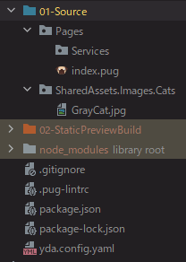
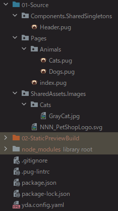
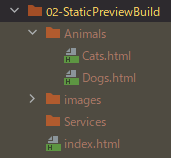
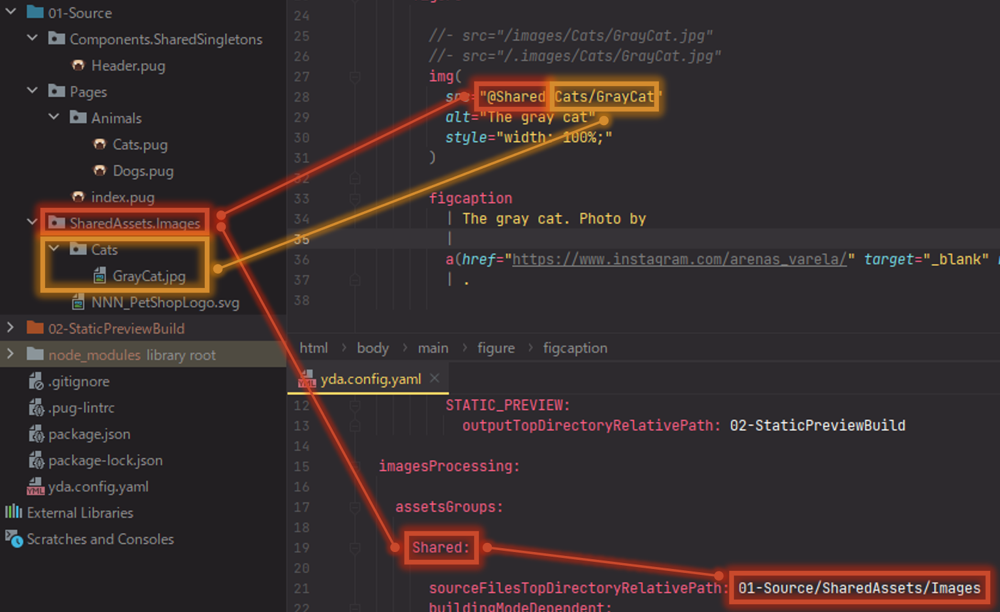
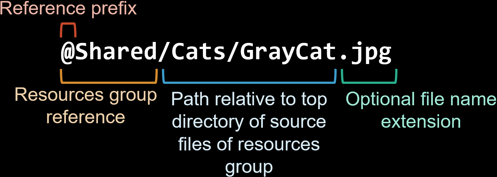

# Resolving of paths to resources
## How it was done without YDA
### Absolute paths and it's pitfalls

Consider below project and YDA setup. 
According to it, the image files below **01-Source/SharedAssets/Images** will be copied below 
  **02-StaticPreviewBuild/images** and **http://localhost:3000** will refer to **02-DevelopmentBuild/StaticPreview** 
  local directory:



```yaml
projectBuilding:

  markupProcessing:

    entryPointsGroups:

      StaticPreview:

        topDirectoryRelativePath: 01-Source/Pages

        buildingModeDependent:
          STATIC_PREVIEW:
            outputTopDirectoryRelativePath: 02-StaticPreviewBuild

  imagesProcessing:

    assetsGroups:

      Shared:

        sourceFilesTopDirectoryRelativePath: 01-Source/SharedAssets/Images
        buildingModeDependent:
          STATIC_PREVIEW:
            outputTopDirectoryRelativePath: 02-StaticPreviewBuild/images

  browserLiveReloading:

    setups:

      StaticPreview:

        localServer:
          rootDirectoryRelativePath: 02-StaticPreviewBuild

```

Now we can refer to the file **01-Source/SharedAssets/Images/Cats/GrayCat.jpg** (will be output to 
  **02-StaticPreviewBuild/images/Cats** directory) by shortened absolute path:

```pug
img(
  src="/images/Cats/GrayCat.jpg"
  alt="The gray cat"
)
```

Assume that above code presents in the file **01-Source/Pages/index.pug**.
Now if we will run the YDA by

```bash
yda build --mode STATIC_PREVIEW
```

once initial building of the project done, the top page will be opened in the default browser and the image
  will display.

Everything seems to be right.
In anything wrong?

First we need to compute in our head the output destination of **GrayCat.jpg** 
  (it will be "02-StaticPreviewBuild/images/Cats/GrayCat.jpg") to specify it in `src` attribute.
The good project building system must take care about this routine.

Second, the image will display as long as the HTML and image file are being hosted from some server - the local development
  server or real one.
In this case, the local server provided by the [Browsersync](https://browsersync.io) (one of YDA's dependency)
  will resolve the shortened absolute path **/images/Cats/GrayCat.jpg** to **http://localhost:3000/images/Cats/GrayCat.jpg** .
But what if wee need to send the files for the check to the customer or manager?

If they open the file in **C:\Users\GretCustomer\Downloads** of Windows OS for example, the **GrayCat.jpg** will not 
  be displayed because **/images/Cats/GrayCat.jpg** will be resolved to **C:\images\Cats\GrayCat.jpg**.
And what you will say to your customer?
"Oh, it is because you have not the local server.
First, please register on the GitHub and let me know the email associated with your account - I'll send the invitation link for you.
Then, install the Git version control system and clone the repository.
You need also to install the Node.js.
Once done, open the terminal and change the directory to directory of the cloned project.
Then, install the Node.js dependencies by "npm install".
Once done, execute the command "npm run dev" and you will see the images!"

Your customer will curse you and will be right because you are forcing the customer to do the work which requires
  the professional knowledge and skills.
Neither customers nor managers must understand the Node.js, source code management, dependencies management,
  project building etc.
All that they want is open file - and everything displaying.

One solution is the shared development environment like AWS and similar services suggests.
However, this solution adds the new variable to the equation - the new service, new expenses, new troubles...
The server will be required for the production and, probably, for testing and staging, but the non-local development server
  is one more problem.
It must be the solution which does not add the new factor besides project building system whatever YDA or not.
The sharing of the HTML/CSS files is completely valid option, but this method is not compatible with absolute paths
  to resources.

Conclusion: the shortened absolute path is safe and flexible when the files are being hosed from some server, 
  but it does not work when the HTML files are being viewed locally without development server. 


### Relative paths and it's pitfalls

The changing of the absolute path to relative will solve above problem: the image will be displayed for both local server
  and without server cases.
Or rather - it seems has been solved.

```pug
img(
  src="./images/Cats/GrayCat.jpg"
  alt="The gray cat"
)
```

Let us add two new pages:

* 01-Source/Pages/Animals/Cats.pug
* 01-Source/Pages/Animals/Dogs.pug

It is important that these pages are in different directory that **index.pug**.
It is completely normal to organize the files it means the good project building system must support it.

The **index.html**, **Cats.html** and **Dogs.html** will use the same header with image.
Let us prepare it in **01-Source/Components/SharedSingletons**:

```pug
mixin Header

  header.Header&attributes(attributes)

    img(
      src="./images/NNN_PetShopLogo.svg"
      alt="The logo of NNN pet shot"
    )

    h1 The NNN pet shop
```

Once and the "NNN_PetShopLogo.svg" image, the project structure will be:



Finally, add the **Header** mixin to each of **index.pug**, **Cats.pug** and **Dogs.pug**.

If we build the project and open the **index.html**, the logo will display.
But if we open the **02-StaticPreviewBuild/Animals/Cats.html** or **02-StaticPreviewBuild/Animals/Dogs.html**,
  it will not display, because the relative path **./images/NNN_PetShopLogo.svg** is correct only if the
  parent HTML file is in the same level with **images** directory while in the **Cats.html** and **Dogs.html** case
  the **images** directory is above **Animals** directory.


  
Moreover, we do not know and _must not_ know at advance in which HTML file the Header component will be included:
  being the reusable component, it must be displayed correctly in any page.

So, what we have to do?
The short answer: the good project building system must resole the correct relative path for each HTML output file.
Of course, YDA does.


## The references - the YDA solution

In short, for the above example and with YDA, we can specify below **src** values: 

```pug
img(
  src="@Shared/Cats/GrayCat.jpg"
  alt="The gray cat"
)
```

```pug
img(
  src="@Shared/NNN_PetShopLogo.svg"
  alt="The logo of NNN pet shot"
)
```

Here, the "@Shared" is the images group ID specified in YDA configuration:



The `Cats/GrayCat` is the path to _source_ (not output one) relative to **sourceFilesTopDirectoryRelativePath** -
  you don't need to compute it your head the output file.

You can ever omit the filename extension - the YDA will automatically search the specified file name with appended ".jpg", 
  ".png", "gif", "svg", "ico" and "webp" extensions (well, it will take some performance during local development but does not
  affect to deployed site / application).

```pug
img(
  src="@Shared/Cats/GrayCat"
  alt="The gray cat"
)
```

### Into relative or absolute path the reference will be resolved?

* As default, the **resources references** will be resolved to _absolute_ paths for all project building modes
  _except_ **static preview**.
* As explained above, the absolute path is _conceptually incompatible_ with static preview, thus for the static preview
  mode the resources references will always be resolved to relative path.

|              Mode | Default path type               |
|------------------:|---------------------------------|
|    Static preview | Relative (could not be changed) |
| Local development | Absolute                        |
|           Testing | Absolute                        |
|           Staging | Absolute                        |
|        Production | Absolute                        |

To resolve the absolute path, it is required to specify the so-called **public path** at 
  `projectBuilding.commonSettings.publicDirectoriesRelativePaths[PRJECT_BUILDING_MODE]`- the path of directory below which
  all files that available for every visitor of web site/application regardless of authentication / authorization.
Usually the folder has **public** name, however because depending on project building mode the output directory could differ,
  the path of **public** directory (relative to project to directory) will differ to.

* If the `projectBuilding.commonSettings.publicDirectoriesRelativePaths[PRJECT_BUILDING_MODE]` has not been specified
  on non-static preview mode, the warning about unable to resolve the resources references to absolute paths will be emitted,
  with these references will be resolved to relative paths instead.
* If you want the resources references resolved to relative path on non static preview modes, specify
  `projectBuilding.common.buildingModeDependent[PRJECT_BUILDING_MODE].mustResolveResourceReferencesToRelativePaths`
  with `true`.


### Anatomy
#### The reference to resource of group



<dl>

  <dt>Reference prefix</dt>
  <dd>
    Used for programmatic recognizing of resource reference. 
    Currently it is always "@" characters and it could not be customized. 
  </dd>

  <dt>Resource group reference</dt>
  <dd>Consists from the reference prefix and resources group ID.</dd>
  
  <dt>Path relative to top directory of source files of resources group</dt>
  <dd>
    The value of <b>sourceFilesTopDirectoryRelativePath</b>.
    Note that this relative path is about <i>source</i> file, not output one - the computing of relative on is
      the YDA's role.
  </dd>

  <dt>Optional file name extension</dt>
  <dd>
    Could be omitted in most cases.
    The only exception is when there are multiple source files with same file name but difference extensions,
      herewith these extension does not change during project building (for example, "WhiteKitten.jpg" and "WhiteKitten.webp").
  </dd>


</dl>


